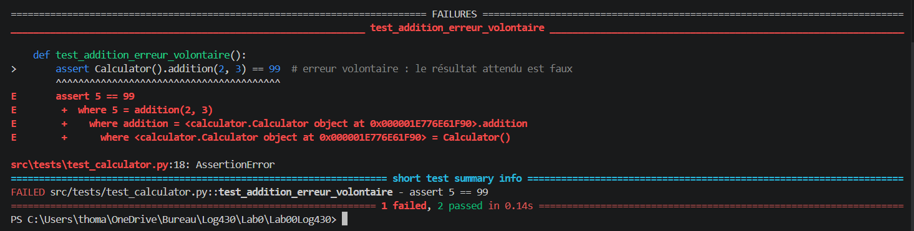

# Rapport – Labo 00 : Infrastructure (Git, Docker, CI/CD)

ÉTS - LOG430 - Architecture logicielle

**Étudiant : Thomas Journault**  
**Date : 11 mai 2026**  

---

## Question 1

Si l'un des tests échoue à cause d'un bug, comment pytest signale-t-il l'erreur et aide-t-il à la localiser ? Rédigez un test qui provoque volontairement une erreur, puis montrez la sortie du terminal obtenue.

### Réponse

Lorsqu'un test échoue, pytest affiche un rapport détaillé qui aide à localiser l'erreur de plusieurs façons :

- **Le nom du test en échec** est affiché clairement avec la mention `FAILED` en rouge dans le bas tu test.
- **L'erreur est montrer sur plusieurs ligne qui commence par E** qui nous dit d'où viens l'erreur et nous dit la ligne et le fichier ou l'erreur c'est produite a la fin. dans ce cas ci `src\tests\test_calculator.py:18` donc le fichier test_calculator à la ligne 18.
- **La valeur obtenue et la valeur attendue** sont comparées côte à côte, ce qui permet de voir immédiatement l'écart.
- Un résumé final indique le nombre de tests passés, échoués et ignorés.

### Test provoquant volontairement une erreur

```python
def test_addition_erreur_volontaire():
    assert Calculator().addition(2, 3) == 99  # erreur volontaire : le résultat attendu est faux
```


### Sortie du terminal



---

## Question 2

Que fait GitHub pendant les étapes de « setup » et « checkout » ? Veuillez inclure la sortie du terminal GitHub CI dans votre réponse.

---

## Question 3

Quel type d'informations pouvez-vous obtenir via la commande `top` ? Veuillez donner quelques exemples. Veuillez inclure la sortie du terminal dans votre réponse.
